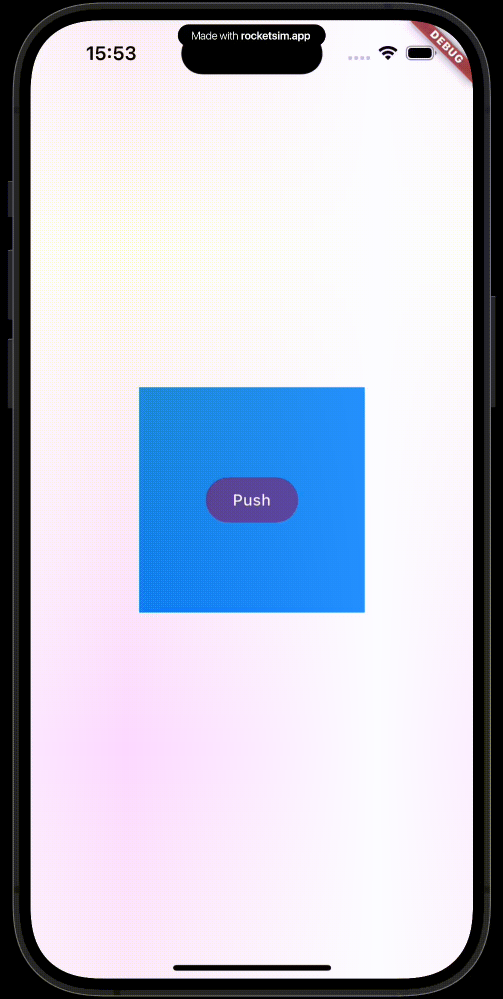

# NavigatorResizable

     

A thin wrapper around `Navigator` that *visually* resizes the child navigator to match the size of the content displayed in the current route. All standard navigation APIs, such as `Navigator.push`, `Navigator.pop`, [named routes](https://api.flutter.dev/flutter/widgets/Navigator-class.html#:~:text=Using%20named%20navigator%20routes), and the [Pages API](https://api.flutter.dev/flutter/widgets/Navigator-class.html#:~:text=the%20current%20page.-,Using%20the%20Pages%20API,-The%20Navigator%20will) (e.g., [go_router](https://pub.dev/packages/go_router), [auto_route](https://pub.dev/packages/auto_route)), can be used with `NavigatorResizable`, just as with the regular navigator.

 

 

 

## Resources

- See [/example](https://github.com/fujidaiti/navigator_resizable/tree/main/example/lib) for the basic usage and practical examples.
- See the [API documentation](https://pub.dev/documentation/navigator_resizable/latest/navigator_resizable/NavigatorResizable-class.html) for the detailed description of the `NavigatorResizable` widget.

 

## Questions

If you have any questions, feel free to ask them on the [discussions page](https://github.com/fujidaiti/navigator_resizable/discussions).

 

## Contributing

Contributions are what make the open source community such an amazing place to learn, inspire, and create. Any contributions you make are **greatly appreciated**.

If you have a suggestion that would make this better, please fork the repo and create a pull request. You can also simply open an issue with the tag "enhancement". Don't forget to give the project a star! Thanks again!

1. Fork the Project
2. Create your Feature Branch (`git checkout -b feature/AmazingFeature`)
3. Commit your Changes (`git commit -m 'Add some AmazingFeature'`)
4. Push to the Branch (`git push origin feature/AmazingFeature`)
5. Open a Pull Request

 

## Links

- [API Documentation](https://pub.dev/documentation/navigator_resizable/latest/)
- [pub.dev](https://pub.dev/packages/navigator_resizable)
- [norelease.dev](https://pub.dev/publishers/norelease.dev/packages)

 
